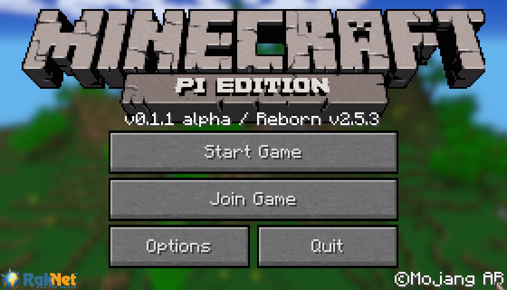
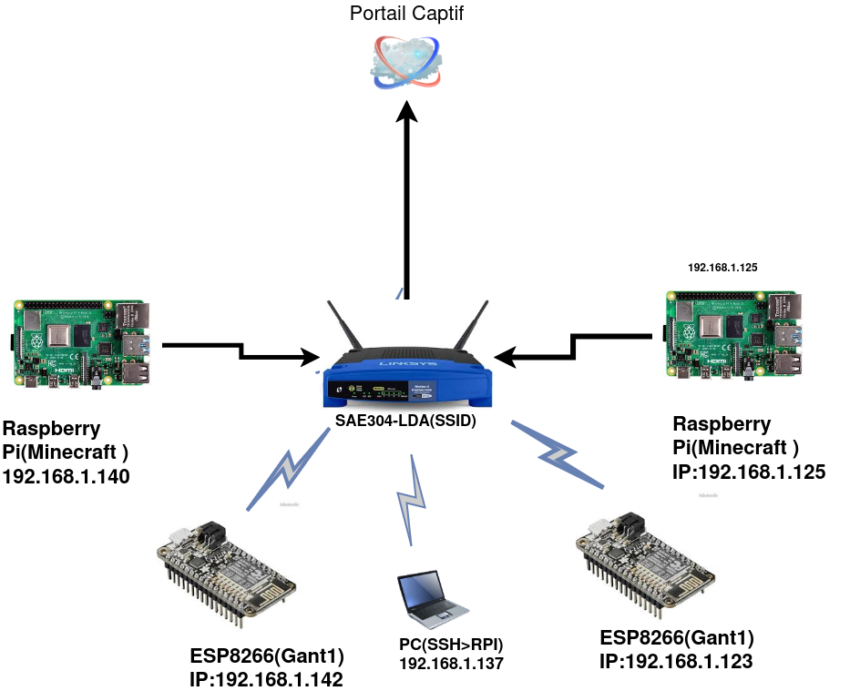
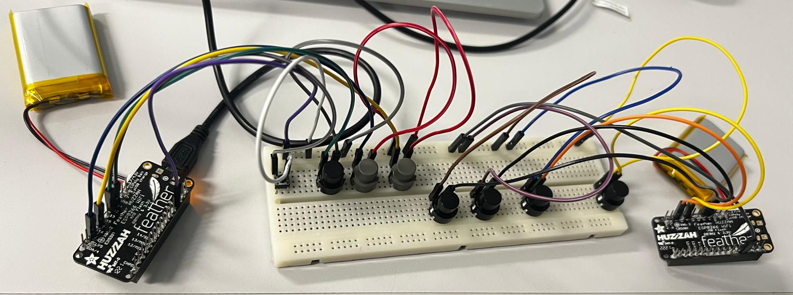
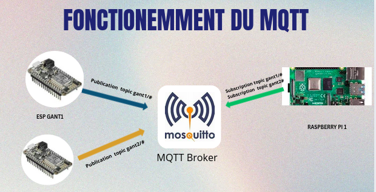

  

# Minecraft IoT Multiplayer – ESP8266 + Raspberry Pi + MQTT

This project connects Minecraft gameplay with physical IoT devices using ESP8266, MQTT, Python, and Raspberry Pi.
Two players interact in a shared Minecraft world while wearing connected gloves equipped with push-buttons that trigger superpowers and malus effects inside the game.

📄 The full technical report is available in: docs/report.pdf

## 🕹️ Minecraft Game Logic

Two players race to collect a diamond

Python scripts monitor map changes

Winner is detected automatically

Game reacts dynamically to IoT button presses

## ## 🧱 Network Infrastructure

  

## 🎮 Features
### 🧤 IoT-Enhanced Gameplay

Gloves equipped with push-buttons

Each button sends an MQTT message

Python scripts apply effects inside Minecraft in real time

## ## 🔌 Hardware Setup (ESP8266 + Push Buttons)

  

This is the physical IoT interface used by the players.  
The ESP8266 Feather HUZZAH is wired to several push-buttons mounted on a small prototype board.

Each button publishes an MQTT message to a dedicated topic (superpowers and malus actions).  
These messages are received by the Python script running on the Raspberry Pi, which then applies the effects inside Minecraft in real-time.

## 🌀 MQTT Communication Flow

  

## ⚡ Superpowers

Dig a hole

Create a water elevator

Build a glowstone mega-wall

## 🔥 Malus (Negative Effects)

Lava wall

TNT barrier

Temporary traps and obstacles

## 🛠️ Technologies Used

ESP8266 Feather HUZZAH

paho-mqtt

Mosquitto MQTT Broker

Raspberry Pi 4 (Debian Buster/Bullseye)

Minecraft Pi Edition

Arduino IDE 1.8.x

## 📜 License

MIT or Apache 2.0 (choose the one you prefer)

## 🧩 Author
Made by

Anete Neto

Lina El Amrani

Mame Diarra Wade
